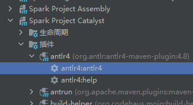

# 实现 Compact table command

1. 要求：
   添加 `compact table` 命令，用于合并小文件，例如表 test1 总共有 50000 个文件，每个 1MB，通过该命令，合成为 500 个文件，每个约 100MB。
2. 语法：
   `COMPACT TABLE table_identify [partitionSpec] [INTO fileNum FILES]`；
3. 说明:

   基本要求是完成以下功能：
   * `COMPACT TABLE test1 INTO 500 FILES`；
   * 如果添加 `partitionSpec`，则只合并指定的 `partition` 目录的文件；
   * 如果不加 `into fileNum files`，则把表中的文件合并成 128MB 大小。

# 解题思路

与`SHOW VERSION`的作业思路一致

1. 修改SqlBase.g4文件：在statement、ansiNonResvered、nonReserved、keyword list四个节内添加相关命令
2. 执行Maven里的anltr4
3. 修改SparkSqlParser.scala文件，添加相关方法
4. 修改commands.scala文件
5. 重新编译Spark
6. 执行


#### 修改`SqlBase.g4`文件（\spark-3.2.1\sql\catalyst\src\main\antlr4\org\apache\spark\sql\catalyst\parser\SqlBase.g4）

* statement

   ```shell
   | COMPACT TABLE target=tableIdentifier partitionSpec?
   (INTO fileNum=INTEGER_VALUE identifier)? #compactTable
   ```

* ansiNonResvered

   ```shell
   | FILES
   ```

* nonReserved

   ```shell
   | FILES
   ```

* keyword list

   ```shell
   FILES: 'FILES';
   ```

#### 执行anltr4:anltr4



#### 修改`SparkSqlParser.scala`文件,重写`visitCompactTable`方法

```scala
override def visitCompactTable(ctx: CompactTableContext): LogicalPlan = withOrigin(ctx) {
     val table: TableIdentifier = visitTableIdentifier(ctx.tableIdentifier())
     val fileNum: Option[Int] = ctx.INTEGER_VALUE().getText.toInt
     CompactTableCommand(table, fileNum)
 }
```
    

## 5、在 `commands.scala` 类中增加实现类 `CompactTableCommand`
   
   ```scala
    case class CompactTableCommand(table: TableIdentifier,fileNum: Option[Int]) extends LeafRunnableCommand {
        override def output: Seq[Attribute] = Seq(AttributeReference("no_return", StringType, false)())
        override def run(spark: SparkSession): Seq[Row] = {
            val dataDF: DataFrame = spark.table(table)
            val num: Int = fileNum match {
                case Some(i) => i
                case _ =>
                (spark
                .sessionState
                .executePlan(dataDF.queryExecution.logical)
                .optimizedPlan
                .stats.sizeInBytes / (1024L * 1024L * 128L)
                ).toInt
            }

            log.warn(s"fileNum is $num")
            val tmpTableName = table.identifier+"_tmp"
            dataDF.write.mode(SaveMode.Overwrite).saveAsTable(tmpTableName)
            spark.table(tmpTableName).repartition(num).write.mode(SaveMode.Overwrite).saveAsTable(table.identifier)
            spark.sql(s"drop table if exists $tmpTableName")
            log.warn("Compacte Table Completed.")
            Seq()
        }
    }
   ```

#### 执行命令

   ```shell
   ./build/sbt clean package -Phive -Phive-thriftserver -DskipTests
   ```

#### 执行 `./bin/spark-sql`，进入 spark-sql 控制台之后，执行相关命令
